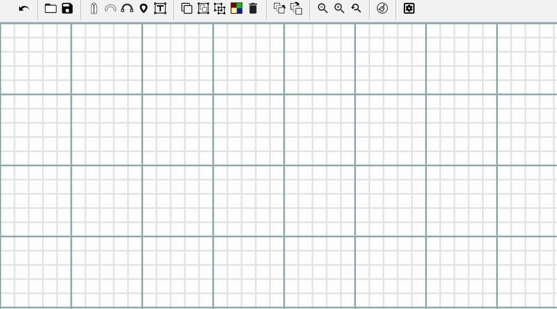

# TattingCAD
Tatting Computer Aided Design
> you can use this app to design your tatting creations.

## 🚀 Usage

Download the repository and open the index.html file using your web browser.

## ✨ Demo

## 🤝 Contributing

Contributions, issues and feature requests are welcome. 
Feel free to check [issues page](https://github.com/fkossyvas/TattingCAD/issues) if you want to contribute. 

## 🔲 TODO

Use the Preferences button to setup some variables by defualt such as initial zoom level, enable/disable zoom using mouse scroll wheel etc.

## 👤 Author

**Fotios Kossyvas**

- Twitter: [@fkossyvas](https://twitter.com/fkossyvas)
- Github: [@fkossyvas](https://github.com/fkossyvas)

## Show your support

Please ⭐️ this repository if this project helped you!

## 📝 Copyright

TattingCAD is Copyright © 2020 Fotios Kossyvas. It is distributed under the [Mozilla Public License version 2.0](https://www.mozilla.org/MPL/2.0/). A copy of the license is available in the distributed LICENSE file.

TattingCAD uses the following third-party libraries:
- [Javascript Canvas Library, SVG-to-Canvas (& canvas-to-SVG) Parser](https://github.com/fabricjs/fabric.js)
- [Javascript library for adding Google-style toolbars to your web app](https://github.com/danielktaylor/gToolbars.js)
- [An HTML5 saveAs() FileSaver implementation](https://github.com/eligrey/FileSaver.js)
- [jQuery JavaScript Library v3.4.1](https://jquery.com/)
- [Very simple jQuery color picker](https://github.com/tkrotoff/jquery-simplecolorpicker)
